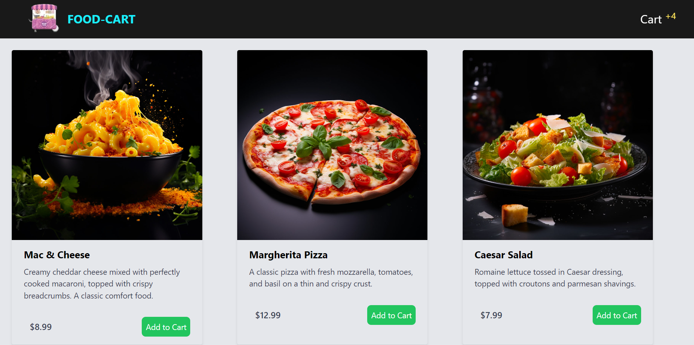

# React Food Ordering App

This is a simple food ordering app built using React and Firebase Firestore for data storage.



## Features

- Users can browse different food items available.
- Users can add items to their cart.
- Users can place orders.

## Demo

[Link to live demo](https://food-order-kappa-six.vercel.app/) - a link to a deployed version of this app.

## Screenshots

Include screenshots of your app here to give users a preview of its interface.

## Technologies Used

- React.js
- Firebase Firestore
- HTML5
- CSS3
- JavaScript
- Tailwind CSS

## Installation

1. Clone the repository:

    ```bash
    git clone https://github.com/TheValour/Food-Order.git
    ```

2. Navigate into the project directory:

    ```bash
    cd react-food-ordering-app
    ```

3. Install dependencies:

    ```bash
    npm install
    ```

4. Set up Firebase:

   - Create a Firebase project at [Firebase Console](https://console.firebase.google.com/).
   - Enable Firestore database.
   - Set up Firebase Authentication (if needed).
   - Obtain your Firebase configuration credentials.
   - Replace the Firebase configuration in `src/firebase/firebaseConfig.js` with your own credentials.

5. Start the development server:

    ```bash
    npm run dev
    ```

6. Open your browser and visit `http://localhost:3000` to see the app.

## Folder Structure

```
├── public
├── src
│   ├── components
│   │   ├── Cart.js
│   │   ├── FoodItem.js
│   │   ├── Navbar.js
│   │   └── ...
│   ├── firebase
│   │   └── firebase.js
│   ├── context
│   │   └── OrderContext.js
│   ├── App.js
│   ├── main.js
│   └── ...
├── index.html
├── .gitignore
├── package.json
├── tailwind.config.js
├── README.md
├── vite.config.js
└── ...
```

## Contributing

Contributions are welcome! If you have any improvements or features to add, feel free to open an issue or create a pull request.

## Future Enhancements

- Add user authentication for personalized experiences.
- Implement payment integration for online orders.
- Improve UI/UX design for better user engagement.


## License

This project is licensed under the [MIT License](LICENSE).

> TheValour :) Developer 🧑‍💻

